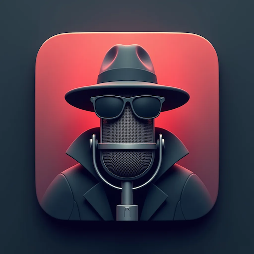

# LocalWhisper MLX

<div align="center">
  
</div>

A simple privacy preserving voice transcription app using whisper-turbo-mlx (based on the whisper-turbo-mlx project by [@jiaaro](https://github.com/jiaaro)), optimized for Apple Silicon Macs. Creates a little button to record audio and get instant transcription to your clipboard. No data leaves your machine. Minimal processing time and then you have the transcript in your clipboard and can paste it wherever you want. It just works, also for longer audio (chunking).


## Features

- Simple one-button interface
- Visual feedback (green/red/orange) for recording status
- Uses whisper-turbo-mlx for fast, local transcription
- Supports unlimited recording duration through audio chunking
- Automatically copies transcription to clipboard
- Optimized for Apple Silicon (M1/M2/M3/M4)
- Supports multiple languages automatically

## Requirements

- macOS with Apple Silicon
- Python 3.12+
- ffmpeg

## Installation

1. Install ffmpeg:
```bash
brew install ffmpeg
```

2. Clone the repository:
```bash
git clone https://github.com/RolandJAAI/LocalWhisper.git
cd LocalWhisper
```

3. Create and activate a virtual environment:
```bash
python -m venv .venv
source .venv/bin/activate
```

4. Install dependencies:
```bash
pip install -r requirements.txt
```

## Usage

Make sure you have allowed your terminal to access your microphone in the macOS Settings before running the application.
1. Run the application:
```bash
python whisper_dictate.py
```

2. A window with a green button will appear
3. Click the button to start recording (turns red)
4. The button will show elapsed recording time
5. Click again to stop recording (turns orange while processing)
6. When the button turns green again, the transcription is ready and copied to your clipboard
7. Paste the transcription anywhere (⌘V)

## Status Indicators

- 🟢 Green: Ready to record
- 🔴 Red: Recording in progress (shows elapsed time)
- 🟡 Orange: Processing transcription

## Technical Details

The application uses a chunking system that:
- Records audio in 60-second chunks
- Processes each chunk separately
- Combines all chunks into one seamless transcription
- Supports recordings of any length
- Manages memory efficiently

## Dependencies

- whisper-turbo-mlx: Fast Whisper implementation for Apple Silicon
- pygame: GUI interface
- pyperclip: Clipboard operations

## Credits

Made by [@RolandJAAI](https://github.com/RolandJAAI)
based on the whisper-turbo-mlx project by [@jiaaro](https://github.com/jiaaro)

## License

MIT License
